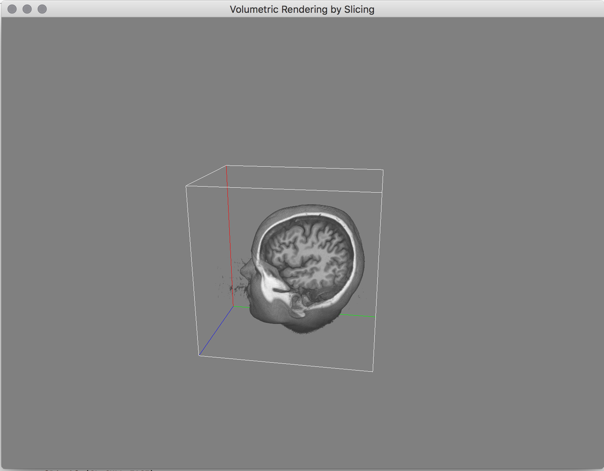

# Volumetric Rendering by Slicing

Simple demo for a volumetric renderer using the 'slicing' technique ( https://en.wikipedia.org/wiki/Volume_rendering#Texture-based_volume_rendering ).

Data from: http://www.visualizationlibrary.org/documentation/pag_guide_sliced_volume.html
